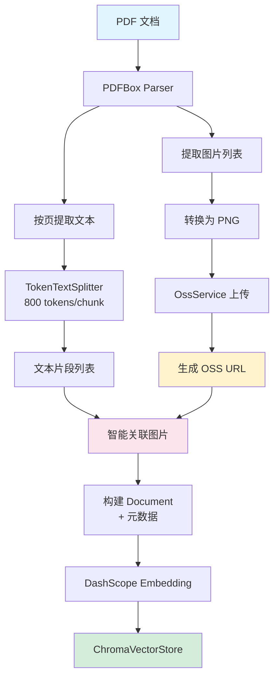

# Douya (豆芽) - 智能体后端服务

## 简介

Douya 是一个基于 Spring Boot 开发的智能体（AI Agent）后端服务。它集成了 **Spring AI Alibaba** 框架，利用阿里云 DashScope（通义千问）提供强大的大模型能力，并预置了 **飞书 (Feishu/Lark)** 开放平台的集成能力，旨在构建高效的企业级 AI 应用。

## 技术栈

- **核心框架**: Spring Boot 3.5.8
- **AI 框架**: Spring AI Alibaba (Agent Framework)
- **大模型服务**: Alibaba DashScope
- **向量数据库**: Chroma Vector Store
- **嵌入模型**: DashScope Embedding (qwen2.5-vl-embedding)
- **API 文档**: Knife4j (Swagger/OpenAPI 3)
- **工具库**: Lombok, Feishu OAPI SDK
- **构建工具**: Maven
- **JDK 版本**: Java 21

## 快速开始

### 1. 环境准备

- JDK 21 或更高版本
- Maven 3.x

### 2. 配置

项目默认使用 `dev` 环境配置。请确保在 `src/main/resources/application-dev.yml` 中配置正确的密钥信息：

```yaml
spring:
  ai:
    dashscope:
      api-key: <YOUR_DASHSCOPE_API_KEY>
    vectorstore:
      chroma:
        collection-name: douya_collection
        client:
          host: http://localhost
          port: 8000

feishu:
  app-id: <YOUR_FEISHU_APP_ID>
  app-secret: <YOUR_FEISHU_APP_SECRET>
```

**注意**: 使用向量存储功能前，需要先启动 Chroma 服务。可以使用 Docker 快速启动：

```bash
docker run -d -p 8000:8000 chromadb/chroma
```

### 3. 启动项目

在项目根目录下运行：

```bash
mvn spring-boot:run
```

### 4. 访问服务

项目启动后，默认运行在 `8787` 端口。

- **API 文档 (Knife4j)**: [http://localhost:8787/api/doc.html](http://localhost:8787/api/doc.html)
- **健康检查**: [http://localhost:8787/api/douya/hello](http://localhost:8787/api/douya/hello)

### 记忆存储架构 (Hierarchical Memory Architecture)

项目采用基于 **分级存储策略** 的智能体记忆管理方案，在保证响应延迟（Latency）的同时，实现了海量上下文的持久化与语义检索。

| 存储方案         | 定位     | 核心技术                         | 优势                                                          |
| :--------------- | :------- | :------------------------------- | :------------------------------------------------------------ |
| **L1: 热记忆**   | 实时会话 | `MemoryStore` (JVM Cache)        | 🚀 **零延迟**，承载当前活跃的上下文窗口（Sliding Window）     |
| **L2: 冷记忆**   | 历史归档 | `PostgresStore` (Persistent SQL) | 🛡️ **高可靠**，结构化存储全量历史，支持跨会话上下文恢复       |
| **L3: 知识记忆** | 专家知识 | `ChromaVectorStore` (Vector DB)  | 🧠 **Agentic RAG**，按需主动检索，支持混合搜索（本地 + 联网） |

#### 1. L1 内存缓存 (MemoryStore)

- **作用**: 存储当前 `threadId` 下的活跃消息列表。
- **性能**: JVM 内存读写，确保多智能体（Supervisor）频繁流转时的极致性能。

#### 2. L2 自定义持久化存储 (PostgresStore)

- **挑战**: Spring AI 默认的 `DatabaseStore` 使用 MySQL 语法，在 PostgreSQL 下会触发语法错误。
- **解决**: 手动实现 `PostgresStore`，采用 `INSERT ... ON CONFLICT` 适配 PG 方言，并引入 `BIGSERIAL` 主键提升海量数据下的索引性能。
- **冷启动恢复**: 系统具备 **Context Rehydration (上下文脱水重张)** 能力。当用户新开会话或服务重启后，系统能自动从 L2 存储中拉取最近的 N 条记录重新填入手状态。

使用非 `MemoryStore` 方案时，需要准备相应的外部服务并添加 Maven 依赖：

- **RedisStore**:
  - **服务**: 需安装 Redis Server (推荐 6.0+)。
  - **依赖**: `spring-boot-starter-data-redis`。
- **调整 DeepSeek 集成**: 由于 Spring AI 1.0.0-M6 不包含 `spring-ai-starter-model-deepseek`，已将其替换为 `spring-ai-openai-spring-boot-starter`，并通过 OpenAI 兼容模式连接 DeepSeek API。相关配置已在 `ModelConfig.java` 中更新。
- **自定义 PostgresStore**: 解决了 `DatabaseStore` 在 PostgreSQL 下使用 MySQL 语法 (`ON DUPLICATE KEY UPDATE`) 导致的语法错误问题。新增 `PostgresStore` 实现类，采用 `INSERT ... ON CONFLICT` 语法适配 PostgreSQL，并在 `DataSourceConfig` 中完成了替换。
  - **初始化**: 需手动创建存储 Session/State 的数据表 (Schema)。
- **MongoStore**:
  - **服务**: 需安装 MongoDB Server。
  - **依赖**: `spring-boot-starter-data-mongodb`。

> **⚠️ 重要区分**:
> 上述要求仅针对 **Agent 记忆/状态 (Memory/State)** 存储。
>
> - 它们只需要标准的数据库功能 (KV 读写 / SQL 查询)。
> - **不需要** 安装 `Redis Stack` (RediSearch) 或 `pgvector` 等向量插件。
> - (向量插件仅在您使用 Redis/PG 替代 Chroma 作为 **向量数据库 (Vector Store)** 时才需要)。

### 方案建议

1.  **当前状态**: 为了保证项目 **快速启动 (Quick Start)** 且不依赖过多外部环境，项目默认使用 **`MemoryStore`**。这意味着重启服务后，用户的短期对话历史和临时偏好将会丢失。
2.  **生产建议**: 对于 **生产环境**，强烈建议切换为 **`RedisStore`**。
    - 它能提供毫秒级的状态读写，这对 AI 对话的响应速度至关重要。
    - 支持数据持久化，确保用户偏好不会因服务重启而丢失。
    - 原生支持分布式锁和过期策略，适合管理海量会话。

### 如何切换到 RedisStore

1.  添加 Redis 依赖到 `pom.xml`:
    ```xml
    <dependency>
        <groupId>org.springframework.boot</groupId>
        <artifactId>spring-boot-starter-data-redis</artifactId>
    </dependency>
    ```
2.  修改代码 (如 `EatingMasterApp.java`):

    ```java
    // 注入 RedisTemplate
    @Autowired
    private RedisTemplate<String, Object> redisTemplate;

    // 替换 MemoryStore
    // MemoryStore memoryStore = new MemoryStore();
    RedisStore redisStore = new RedisStore(redisTemplate);
    ```

## 项目结构

```
douya
├── src/main/java/com/tengjiao/douya
│   ├── app
│   │   └── UserVectorApp.java      # 用户向量服务（向量存储与搜索）
│   ├── config
│   │   ├── ChromaConfig.java       # Chroma 向量数据库配置
│   │   ├── ChromaProperties.java   # Chroma 配置属性
│   │   └── FeishuConfig.java       # 飞书 WebSocket 配置
│   ├── controller
│   │   ├── AiController.java       # AI 相关接口
│   │   └── FeishuController.java   # 飞书 Token 接口
│   ├── service
│   │   ├── FeishuService.java      # 飞书服务接口
│   │   └── impl
│   │       └── FeishuServiceImpl.java # 飞书服务实现 (Token 缓存)
│   └── DouyaApplication.java       # 启动类
├── src/main/resources
│   ├── application.yml             # 主配置
│   └── application-dev.yml         # 开发环境配置
└── pom.xml                         # Maven 依赖配置
```

## 功能特性

### 飞书集成 (Feishu Integration)

项目已预置飞书开放平台集成能力，支持：

1.  **WebSocket 长连接**:
    - 自动建立与飞书的长连接，无需公网 IP 即可接收回调。
    - 已实现 `P2MessageReceiveV1` (私聊消息) 和 `P2CardActionTrigger` (卡片交互) 等事件的监听示例。
2.  **Token 管理**:
    - **App Access Token**: 实现了 `app_access_token` 的获取与本地缓存（自动刷新）。
    - **Tenant Access Token**: 实现了 `tenant_access_token` 的获取与本地缓存（自动刷新）。
    - 接口地址:
      - App Token: `POST /api/douya/feishu/token`
      - Tenant Token: `POST /api/douya/feishu/tenant-token`
3.  **消息发送**:
    - 支持发送文本、富文本、卡片等多种类型的消息给指定用户或群组。
    - 接口地址: `POST /api/douya/feishu/message/send?receive_id_type=open_id`
4.  **性能与可靠性优化**:
    - **异步处理**: 使用 Java 21 虚拟线程异步处理耗时的大模型请求，确保在飞书要求的 3 秒内完成事件响应，避免重试。
    - **幂等去重**: 内置消息 ID 缓存（基于 LRU 策略），自动过滤飞书因网络抖动产生的重复推送，防止大模型重复思考。
    - **交互体验**: 采用“先响应、后思考、再回复”的模式，第一时间给用户反馈，消除等待焦虑。

### 向量存储 (Vector Store Integration)

项目集成了 **Chroma 向量数据库**，结合阿里云 DashScope 的 `qwen2.5-vl-embedding` 模型，提供强大的向量存储和语义搜索能力：

1.  **用户隔离的向量存储**:
    - 通过 `UserVectorApp` 服务实现基于 `userId` 的数据隔离。
    - 每个用户的向量数据独立存储，互不干扰。
    - 自动添加时间戳元数据，便于数据管理。
2.  **相似度搜索**:

    - 支持语义相似度搜索，适用于"吃饭大师"等场景。
    - 可配置 Top-K 结果数量（默认 5 条）。
    - 可配置相似度阈值（默认 0.7）。
    - 自动按 `userId` 过滤，确保数据隔离。

3.  **配置说明**:

    ```yaml
    spring:
      ai:
        dashscope:
          api-key: <YOUR_DASHSCOPE_API_KEY>
        vectorstore:
          chroma:
            collection-name: douya_collection
            client:
              host: http://localhost
              port: 8000
    ```

    ````

    4.  **使用示例**:

    ```java
    @Autowired
    private UserVectorApp userVectorApp;

    // 存储向量数据
    List<Document> documents = List.of(
        new Document("川菜馆推荐：麻辣香锅很好吃"),
        new Document("粤菜馆推荐：早茶很正宗")
    );
    userVectorApp.addDocuments(documents, "user123");

    // 相似度搜索
    List<Document> results = userVectorApp.searchSimilar("我想吃辣的", "user123");
    ````

### 用户偏好学习 (User Preference Learning)

项目实现了基于 **DeepSeek** 模型的智能用户偏好学习功能，能够在对话过程中自动分析并提取用户的饮食偏好，实现更懂用户的个性化服务：

1.  **智能提取**:
    - 使用 `PreferenceLearningHook` 拦截 AI 回复后的流程。
    - 利用 DeepSeek 推理模型分析用户的每一条输入消息。
    - 自动提取明确表达的喜好（如"我喜欢吃辣"、"不吃香菜"等）。
2.  **长期记忆**:
    - 基于 `MemoryStore` 实现用户偏好的持久化存储。
    - 偏好数据按 `userId` 隔离存储，随用随取。
    - **存储优化**: 采用 `Set` (LinkedHashSet) 结构存储，自动过滤重复记录，节省资源并保持顺序。
3.  **使用方式**:
    - **对话接口**: `GET /api/douya/chat?message=我喜欢吃火锅&userId=user_001`
      - 系统会在后台自动分析并记录"火锅"这一偏好。
    - **查询偏好**: `GET /api/douya/preferences?userId=user_001`
      - 返回该用户所有已记录的偏好列表。

### Agentic RAG 与混合检索 (Agentic & Hybrid Search)

项目实现了从被动 RAG 到 **Agentic RAG** 的升级，通过 `MemorySearchTool` 让智能体具备了主动思考和检索的能力：

1.  **主动检索 (On-demand Retrieval)**: 智能体不再机械地在每条消息前注入上下文，而是根据 `instruction` 指令，仅在涉及“历史、之前、偏好”等关键词时主动调用 `memory_search` 工具。
2.  **混合检索策略 (Hybrid Search Flow)**:
    - **DailyAssistant** 现在可以同时访问本地记忆库和实时互联网。
    - **降级机制**: 当本地检索无果（例如用户问了一个记忆中没有的新领域喜好）时，智能体会接收到工具反馈的“未找到结果”，并自动触发联网搜索补位。
3.  **Token 优化**: 由于不再盲目注入背景信息，显著降低了日常闲聊场景下的 Prompt Token 消耗。

## 多智能体协作 (Multi-Agent Collaboration)

系统已从单一智能体架构升级为基于 **Supervisor (监督者) 模式** 的多智能体协作架构：

1.  **中心监督者 (DouyaSupervisor)**:
    - 作为系统的“大脑”，负责解析全局意图并管理复杂任务的调度。
    - 挂载 **全局共享 Hooks**（记忆、RAG、偏好学习），确保所有专家智能体共享统一的上下文背景。
2.  **专家智能体 (Sub-Agents)**:
    - **EatingMaster (美食专家)**: 专注于美食文化、烹饪指导、情感共情与日常对话。
    - **VisionUnderstand (视觉专家)**: 专注于对图片、视频等视觉素材进行高信息密度的结构化解析。
3.  **动态流转 (Flow Steering)**:
    - 支持多步流转（Handoffs/Loops），如：用户上传冰箱照片 -> 视觉专家提取食材 -> 监督者调度 -> 美食专家基于提取的食材推荐菜谱。
4.  **架构优势**: 实现了任务的高度解耦，各专家仅需关注自身领域的 Prompt 优化，而监督者负责跨领域的逻辑缝合。

### 用户偏好自动注入 (User Preference Interceptor)

通过 `UserPreferInterceptors` 实现“越聊越懂你”的个性化体验：

1.  **静默拦截**: 拦截器在请求发送给大模型前，自动从数据库加载该用户的长期偏好标签。
2.  **上下文增强**: 动态将提取的偏好（如“少辣”、“不吃香菜”）追加到系统提示词中。
3.  **决策辅助**: 使 Agent 在推荐方案时能自动避开用户忌口，无需用户每次重复输入。

### Agent 配置与性能优化

1.  **结构化提示词**: 将 `SYSTEM_PROMPT` 拆分为 `systemPrompt` (角色设定) 与 `instruction` (任务指令)，使 Agent 性格更鲜明、业务逻辑更易维护。
2.  **响应长度提升**: 将模型最大输出长度 (`maxTokens`) 统一提升至 **2000**，确保详细的长图文建议能完整呈现。

### 多模型冲突解决

由于项目中同时引入了 `spring-ai-alibaba-starter-dashscope` 和 `spring-ai-starter-model-openai`，会导致容器中存在多个 `EmbeddingModel` 实例，从而引发 `VectorStore` 自动配置冲突。

**解决方案：**

1.  **明确指定 Bean**: 在 `ChromaConfig` 中注入 `EmbeddingModel` 时，使用 `@Qualifier("dashscopeEmbeddingModel")` 明确指定使用 DashScope 的模型。
2.  **禁用冲突配置**: 在 `application.yml` 中设置 `spring.ai.openai.embedding.enabled: false`，禁用 OpenAI 的 Embedding 自动配置，确保全局只有一个主嵌入模型（DashScope）。

### 飞书消息资源处理

支持对飞书富文本消息（如图片）的自动化处理：

- **图片自动下载**: 当接收到 `image` 类型消息时，系统会通过 `FeiShuGetMessageResourceUtils` 自动将其下载并保存到项目根目录下的 `src/main/resources/temp` 路径。
- **动态路径计算**: 使用 `ApplicationHome` 动态获取环境目录，确保在不同部署环境下均能正确识别资源存储路径。
- **拟人化多轮分析逻辑**:
  - **意图先行**: 当用户上传图片时，系统进入“等待状态”并记录图片路径，主动询问用户意图而非盲目全量分析。
  - **任务定向解析**: 待用户输入需求后，系统将图片与用户描述共同投喂给多模态大模型。这不仅提升了回答的“人味儿”，更让视觉感知具备了明确的任务指向，大幅提升了解析的准确性。
  - **状态闭环**: 完成分析后自动清除暂存状态，确保对话流的精准切换。

### 火山引擎豆包多模态集成 (Volcengine Doubao Integration)

项目集成了火山引擎方舟 (Volcengine Ark) 平台的豆包 (Doubao) 大模型，支持全模态理解：

1.  **OpenAI 兼容模式**: 使用 `spring-ai-starter-model-openai` 接入。
2.  **配置修正**:
    - **Base URL**: 必须设置为 `https://ark.cn-beijing.volces.com/api/v3` (不含路径)。
    - **路径自定义**: 通过 `.completionsPath("/chat/completions")` 显式指定，避开 Spring AI 默认的 `/v1/chat/completions` 导致 500 错误。
    - **模型标识**: 在方舟平台必须使用 **推理接入点 ID (Endpoint ID)**（形如 `ep-xxxx`）作为 `model` 参数，而非模型名称。
3.  **多模态支持**: 通过 `OpenAiChatModel` 提供图片理解等视觉能力。
4.  **Token 效率优化**:
    - **零冗余约束**: 严格禁止模型输出“这是一张图片...”等开场白，确认为纯粹的“视觉传感器”定位。
    - **高密度注入**: 采用 `[核心主体]`、`[关键细节]` 等紧凑的结构化格式，最大化下游 Agent 处理时的 Token 有效率。

## 开发者

- **Author**: tengjiao
- **GitHub**: [https://github.com/tengjiao](https://github.com/tengjiao)

## 更新日志

### 2026-01-13

- **Agentic RAG 模式升级**: 将 RAG 逻辑从被动注入的 Hook 模式重构为智能体自主调用的 Tool 模式 (`MemorySearchTool`)。
- **混合检索集成**: 为 `DailyAssistant` 注入 RAG 能力，实现了“本地记忆 + 联网搜索”的混合检索逻辑。
- **优化 RAG 空结果处理**: 增强了工具在检索无果时的反馈机制，引导 Agent 自动转向联网搜索，解决了无内容时的响应幻觉。
- **修复 MCP 401 认证问题**: 引入 `McpConfig` 通过 `WebClientCustomizer` 全局注入 `Authorization` Header，解决了 Streamable HTTP 传输协议下的鉴权失败问题。

### 2025-12-30

- **多智能体架构重构 (Supervisor Mode)**: 彻底废弃了原有的单体智能体设计，引入由 `SupervisorAgent` 驱动的协作模式。将视觉感知与美食建议解耦为独立的专家节点，显著提升了复杂、多步骤任务的处理能力。
- **全局 Hook 共享机制**: 实现了将记忆、偏好学习和 RAG 逻辑挂载在监督者层级，确保了专家切换过程中的上下文无缝流转。
- **修复豆包模型 500 错误**: 解决了由于 Spring AI 默认拼接路径与火山引擎方舟接口路径冲突导致的 `InternalServiceError` 问题。通过自定义 `completionsPath` 绕过默认的 `/v1` 路径。
- **重构视觉感知提示词**: 将视觉理解模型（Vision Model）的定位从专一的“大厨助手”重构为通用的“视觉分析专家”。
- **视觉 Token 效率优化**: 引入了“零冗余约束”与“键值对输出”模式，禁止模型产生任何“描述性废话”。
- **首创“意图先行”图片交互流程**: 放弃了收到图片即自动解析的旧模式，改为多轮交互模式。

### 2025-12-22

- **优化 Agent 指令**: 在 `EatingMasterApp` 中明确了联网搜索的指令，解决了模型因系统提示词限制而拒绝使用搜索功能的幻觉问题。

### 2026-01-04

- **解决 uvx 工具链安装问题**: 针对 `pip install uvx` 报错（防御性占位包）的问题，通过正确安装 `uv` 核心包来提供 `uvx` 命令支持。
- **配置 Windows 适配的 MCP Server**: 修改 `mcp-servers.json`，将 `xiaohongshu-automation` 服务配置为使用 `cmd.exe /c` 调用 `uvx`，以确保在 Windows 环境下的兼容性。

### 2026-01-07

- **自定义 Graph 监督者模式 (Custom Graph Supervisor)**: 鉴于官方 `SupervisorAgent` 的不稳定性，移除了其依赖，转为使用 Spring AI Alibaba Graph 的底层 API 手动构建 **有向循环图 (StateGraph)**。
- **自定义 SupervisorNode**: 实现了基于 LLM 的自定义路由节点，增强了对死循环检测和上下文理解的控制力。
- **架构透明化**: 通过显式的图构建 (`EatingMasterGraph`)，提升了多智能体协作流程的可观测性和可维护性。

### 2026-01-14

- **修复 Netty 类缺失问题**: 解决了 `java.lang.NoClassDefFoundError: io/netty/util/AttributeKey` 导致的启动失败问题。通过显式引入 `spring-boot-starter-webflux` 确保了 `WebClient` 及 `ReactorClientHttpConnector` 所需的 Netty 核心依赖项被正确加载。

### 2026-01-17

  2. 升级 `HttpClient` 为 **HTTP/2** 协议(在 `McpRequestConfig` 中配置),利用 HTTP/2 的帧机制避免 HTTP/1.1 分块传输编码可能引发的解析异常。(Issues #2740, #3742)

- **阿里云 OSS 集成**: 实现了 `OssService` 工具类,支持将图片等资源上传至阿里云 OSS 并生成访问链接。主要用于支持 RAG 流程中文档切分后的图片存储与召回需求。

### 2026-01-20

- **PDF 文档切分与向量化**: 实现了完整的 PDF 文档处理能力,支持智能文档解析、图片提取与 OSS 存储、语义切分和向量化。
  - **智能图片关联**: 采用方案 B,根据页码智能关联图片到对应文本片段,避免冗余同时确保准确性。
  - **统一图片格式**: 将 PDF 中的所有图片统一转换为 PNG 格式,确保兼容性和一致性。
  - **异步分批处理**: 支持大文档异步处理,避免超时,提升系统稳定性。
  - **元数据增强**: 在向量元数据中包含图片 OSS URL、页码、片段索引等信息,支持多模态召回。
  - **完整流程**: PDF 解析 → 图片提取 → OSS 上传 → 文本切分 → 智能关联 → 向量化存储。


### 阿里云 OSS 集成 (Aliyun OSS Integration)

项目集成了阿里云 OSS 服务，用于存储和检索各种媒体资源（如 RAG 文档切分中的图片）。

1.  **功能**:
    - 支持文件流上传。
    - 支持本地文件路径上传。
    - 自动生成文件的公共访问 URL，便于在 RAG 流程中回溯图片。

2.  **配置**:
    在 `application.yml` 或 `application-local.yml` 中配置 OSS 密钥：
    ```yaml
    aliyun:
      oss:
        endpoint: <YOUR_OSS_ENDPOINT>
        access-key-id: <YOUR_ACCESS_KEY_ID>
        access-key-secret: <YOUR_ACCESS_KEY_SECRET>
        bucket-name: <YOUR_BUCKET_NAME>
    ```

### PDF 文档切分与向量化 (PDF Document Parsing & Vectorization)

项目实现了智能 PDF 文档处理能力,支持文档解析、图片提取、向量化存储,为 RAG 应用提供强大的文档理解基础。

#### 核心特性

1. **智能文档解析**:
   - 使用 Apache PDFBox 解析 PDF 文档
   - 按页提取文本内容
   - 支持复杂 PDF 格式

2. **图片提取与存储**:
   - 自动提取 PDF 中的所有图片
   - 统一转换为 PNG 格式,确保兼容性
   - 上传至阿里云 OSS,生成可访问 URL
   - 智能关联:根据页码将图片关联到对应文本片段

3. **语义切分**:
   - 使用 `TokenTextSplitter` 进行智能切分
   - 默认 800 tokens/片段,200 tokens 重叠
   - 避免语义断裂,提升检索质量

4. **向量化存储**:
   - 集成 Chroma 向量数据库
   - 使用 DashScope Embedding 模型
   - 元数据包含图片 URL,支持多模态召回

5. **异步处理**:
   - 支持大文档异步分批处理
   - 避免超时,提升系统稳定性

#### 处理流程



#### 元数据设计

每个向量化的文档片段包含以下元数据:

```json
{
  "userId": "user123",
  "documentName": "产品手册.pdf",
  "pageNumber": 5,
  "chunkIndex": 2,
  "images": [
    {
      "fileName": "产品手册_page5_img1.png",
      "ossUrl": "https://bucket.oss-cn-beijing.aliyuncs.com/documents/产品手册/page5_img1.png",
      "position": "page5"
    }
  ],
  "timestamp": "2026-01-20T22:30:00Z"
}
```

#### 使用示例

```java
@Autowired
private PdfDocumentService pdfDocumentService;

// 同步处理 PDF 文档
try (InputStream inputStream = new FileInputStream("document.pdf")) {
    PdfProcessResult result = pdfDocumentService.processPdfDocument(
        inputStream,
        "产品手册.pdf"
    );
    
    System.out.println("总页数: " + result.getTotalPages());
    System.out.println("提取图片: " + result.getImageCount());
    System.out.println("文档片段: " + result.getChunkCount());
}

// 异步处理大文档
CompletableFuture<PdfProcessResult> future = 
    pdfDocumentService.processPdfDocumentAsync(inputStream, fileName);
```

#### 向量检索与图片回溯

```java
// 检索相关文档
List<Document> results = vectorStore.similaritySearch(
    SearchRequest.query("产品特性介绍")
        .withTopK(5)
        .withSimilarityThreshold(0.7)
        .withFilterExpression("userId == 'user123'")
);

// 提取关联的图片 URL
results.forEach(doc -> {
    List<Map<String, Object>> images = 
        (List<Map<String, Object>>) doc.getMetadata().get("images");
    
    if (images != null) {
        images.forEach(img -> {
            String ossUrl = (String) img.get("ossUrl");
            // 直接访问图片或传递给多模态模型
            System.out.println("关联图片: " + ossUrl);
        });
    }
});
```

#### OSS 存储结构

```
documents/
  └── {documentName}/
      ├── page1_img1.png
      ├── page1_img2.png
      ├── page2_img1.png
      └── ...
```

## 开发者
